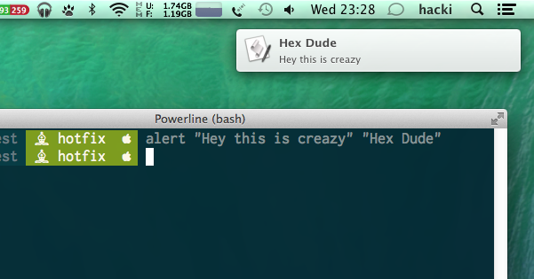

Features
========

Git management
--------------

**The background colour** represents the git status

-  green = no changes
-  yellow = changes detected
-  red = untracked files

**The chess figure** represents the branch you are. `Git flow <https://github.com/nvie/gitflow>`__ is also supported.

-  ♔ = king = master
-  ♙ = pawn = development
-  ♘ = knight = feature
-  ♗ = bishop = hotfix
-  ☂ = umbrella = *other*

**Ohter signs**

-  Arrows “⇡⇣” and number behind represent how many commits you are behind/ahead of the remote
-  Display “+” symbol when current branch is changed but uncommited
-  Display current git branch name, or short SHA1 hash when the head is detached

Prompt
------

-  Platform-dependent prompt symbol for macOS and Linux
-  No need for patched fonts Remote

Additional information
----------------------

You are able to add informations to you prompt by setting following environment variables.

1. ``PS_INFO``: (string) e.g. dev/stage/prod.
2. ``PS_INFO_BRAND``: (string) e.g. info/success/warning/danger

Set this variables in your .bashrc (Linux) ord src/profile (macOS) file like so:

::

   export PS_INFO="stage"
   export PS_INFO_BRAND="warning"

Notification
------------

On macOS and Linux, you have the option to send notifications from the console. However, the commands are different for this purpose. *bashlight* provides you a unified interface. You can play sounds, open the message window and use the voice output.

Play sounds
-----------

::

   blPlay Submarine

Say something
^^^^^^^^^^^^^

::

   blSay "OK Computer. I just understand train station."

Notification messages
---------------------

::

   alert "This is the title" "... and this is the content"

   Notifications

Contains configurations for …
-----------------------------

1. **Git global config**

   -  Shortcuts for all commands
   -  Enhanced git history with colours with git sl
   -  Colours Which harmonize with the colors used as background
   -  Branch setting

-  **Bash aliases (shortcuts)**

   -  *directory*

      -  ll, la, l
      -  cd .. = .. < … < ….

Git global configuration
------------------------

It also include a shell script to set common global bash settings. Before you run the file, take a look in the file. The setting included are tailored to bashlight.
